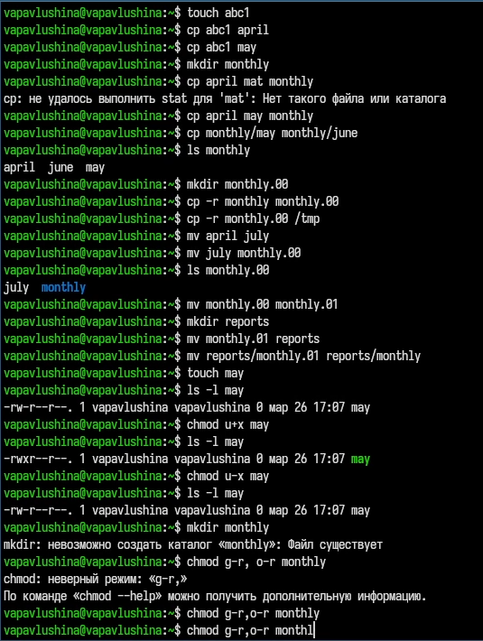
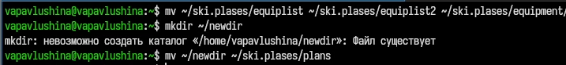

## Front matter
lang: ru-RU
title: Архитектура компьютеров
subtitle: Лабораторная работа №7
author: 
  - Павлушина Виктория Александровна
institute:
  - Российский университет дружбы народов, Москва, Россия
date: 16 мая 2026

## i18n babel
babel-lang: russian
babel-otherlangs: english

## Formatting pdf
toc: false
toc-title: Содержание
slide_level: 2
aspectratio: 169
section-titles: true
theme: default

---

# Информация

## Докладчик

:::::::::::::: {.columns align=center}
::: {.column width="70%"}

* Автор: Павлушина В.А.
* Группа: НКАбд-05-25
* Российский Универститет Дружбы Народов
* [1032253555@rudn.ru](mailto:1032253555@rudn.ru)

:::
::: {.column width="30%"}

:::
::::::::::::::

## Цель работы

Ознакомление с файловой системой Linux, её структурой, именами и содержанием
каталогов. Приобретение практических навыков по применению команд для работы
с файлами и каталогами, по управлению процессами (и работами), по проверке использования диска и обслуживанию файловой системы.

## Задание

1) Ознакомиться с файловой системой Linux, её системой, именами и содержанием.
2) Приобрести практические навыки по применению команды для работы с файлами и каталогами.

## Теоретическая часть

Для создания текстового файла можно использовать команду touch.
Формат команды:
1 touch имя-файла
Для просмотра файлов небольшого размера можно использовать команду cat.
Формат команды:
1 cat имя-файла
Для просмотра файлов постранично удобнее использовать команду less.
Формат команды:
1 less имя-файла
Следующие клавиши используются для управления процессом просмотра:
– Space — переход к следующей странице,
– ENTER — сдвиг вперёд на одну строку,
– b — возврат на предыдущую страницу,
– h — обращение за подсказкой,
– q — выход из режима просмотра файла.
Команда head выводит по умолчанию первые 10 строк файла.
Формат команды:
1 head [-n] имя-файла,
где n — количество выводимых строк.
Команда tail выводит умолчанию 10 последних строк файла.
Формат команды:
1 tail [-n] имя-файла,
где n — количество выводимых строк

##
Команда cp используется для копирования файлов и каталогов.
Формат команды:
1 cp [-опции] исходный_файл целевой_файл
Примеры:
1. Копирование файла в текущем каталоге. Скопировать файл ~/abc1 в файл april
и в файл may:
1 cd
2 touch abc1
3 cp abc1 april
4 cp abc1 may
2. Копирование нескольких файлов в каталог. Скопировать файлы april и may в каталог
monthly:
1 mkdir monthly
2 cp april may monthly
3. Копирование файлов в произвольном каталоге.Скопировать файл monthly/may в файл
с именем june:
1 cp monthly/may monthly/june
2 ls monthly
Опция i в команде cp выведет на экран запрос подтверждения о перезаписи файла.
Для рекурсивного копирования каталогов, содержащих файлы, используется команда
cp с опцией r.
Примеры:
1. Копирование каталогов в текущем каталоге. Скопировать каталог monthly в каталог
monthly.00:
1 mkdir monthly.00
2 cp -r monthly monthly.00
2. Копирование каталогов в произвольном каталоге. Скопировать каталог monthly.00
в каталог /tmp
1 cp -r monthly.00 /tmp

##
Команды mv и mvdir предназначены для перемещения и переименования файлов
и каталогов.
Формат команды mv:
mv [-опции] старый_файл новый_файл
Примеры:
1. Переименование файлов в текущем каталоге. Изменить название файла april на
july в домашнем каталоге:
1 cd
2 mv april july
2. Перемещение файлов в другой каталог. Переместить файл july в каталог monthly.00:
1 mv july monthly.00
2 ls monthly.00
Результат:
1 april july june may
Если необходим запрос подтверждения о перезаписи файла, то нужно использовать
опцию i.
3. Переименование каталогов в текущем каталоге. Переименовать каталог monthly.00
в monthly.01
1 mv monthly.00 monthly.01
4. Перемещение каталога в другой каталог. Переместить каталог monthly.01в каталог
reports:
1 mkdir reports
2 mv monthly.01 reports
5. Переименование каталога, не являющегося текущим. Переименовать каталог
reports/monthly.01 в reports/monthly:
1 mv reports/monthly.01 reports/monthly

##
1. Для файла (крайнее левое поле имеет значение -) владелец файла имеет право на
чтение и запись (rw-), группа, в которую входит владелец файла, может читать файл
(r--), все остальные могут читать файл (r--):
1 -rw-r--r--
2. Только владелец файла имеет право на чтение, изменение и выполнение файла:
1 -rwx------
3. Владелец каталога (крайнее левое поле имеет значение d) имеет право на просмотр,
изменение и доступа в каталог, члены группы могут входить и просматривать его, все
остальные — только входить в каталог:
1 drwxr-x--x

# Выполнение лабораторной работы

{#fig:001 width=70%}
{#fig:002 width=70%}
{#fig:003 width=70%}

## Выводы
Ознакомилась с файловой системой Linux, её структурой, именами и содержанием
каталогов. Приобрела практические навыки по применению команд для работы
с файлами и каталогами, по управлению процессами (и работами), по проверке использования диска и обслуживанию файловой системы
